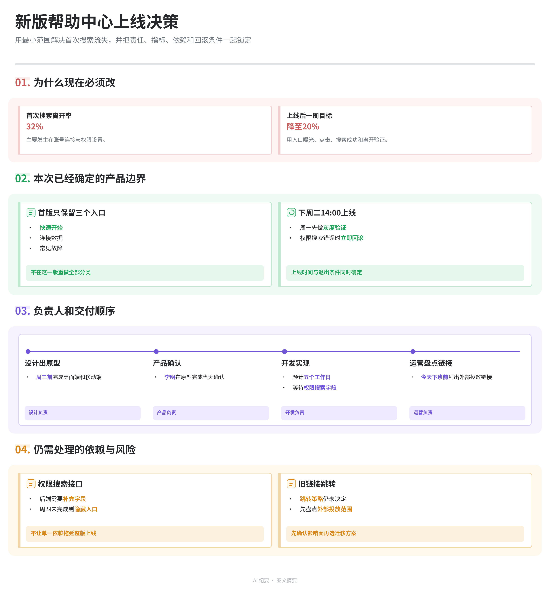

# DingTalk-style Minutes

**把任意受支持的中文录音变成钉钉闪记风格的飞书图文纪要。**

The post-processing brain for recorded conversations: turn a phone recording, AI-recorder file, video, or existing ASR transcript into evidence-linked graphic minutes and one editable Feishu document.

> Independent open-source project inspired by the information architecture of DingTalk AI Minutes. Not affiliated with or endorsed by DingTalk or Alibaba.



## What you get

One recording becomes one Feishu document with exactly three reading depths:

1. **一、内容概览** — one concise paragraph explaining what the recording is fundamentally about.
2. **二、AI 纪要** — an editable graphic-minutes whiteboard followed by hierarchical claims and supporting evidence.
3. **三、完整转写** — a short overview, semantic chapters, speaker labels, chapter summaries, timestamps, and every source segment in order.

## Why this is different

| Typical transcription or meeting tool | DingTalk-style Minutes |
|---|---|
| Transcript plus a generic summary | Overview, visual minutes, structured notes, and full transcript in one document |
| Fixed mind-map template | Content-adaptive cards, processes, comparisons, metrics, quotes, and synthesis |
| Summary detached from the source | Every visual claim carries `source_segment_ids` |
| Static exported image | Editable Feishu whiteboard text and native shapes |
| Meeting-only information architecture | Routes meetings, interviews, lectures, tutorials, reviews, stories, and arguments differently |
| “Looks complete” | Validators require exact chapter order and complete transcript coverage |

This is **not another recorder**. Your phone, AI recorder, camera, or meeting application captures the audio. This skill performs the editorial post-processing.

## Install

Clone the repository, then copy or symlink the packaged skill into your Codex skills directory:

```bash
git clone https://github.com/PoetCoderJun/dingtalk-style-minutes.git
mkdir -p ~/.codex/skills
ln -s "$(pwd)/dingtalk-style-minutes/skill/dingtalk-style-minutes" \
  ~/.codex/skills/dingtalk-style-minutes
```

The workflow also requires these Agent Skills:

- `clean-talking-video` — ASR-only stage for audio/video input
- `substance-writing-review` — editorial structure and natural Chinese
- `beautiful-feishu-whiteboard` — editable SVG-to-Feishu rendering and visual verification
- `lark-doc` and `lark-whiteboard` — Feishu document and whiteboard operations

## Requirements

- Python 3.9-3.13
- Node.js 20+ and npm/npx
- [`lark-cli`](https://github.com/larksuite/cli), authenticated as a Feishu user
- `DASHSCOPE_API_KEY` or `DASHSCOPE_ASR_API_KEY` for audio/video transcription
- Network access to DashScope, the selected LLM provider, npm, and Feishu APIs
- PyYAML for the repository test suite: `python -m pip install pyyaml`

`transcript.json` input can skip DashScope and the ASR dependency.

## Use

Ask Codex:

```text
Use $dingtalk-style-minutes to turn this recording into a DingTalk-style
three-part Feishu document. Keep anonymous speakers anonymous and preserve
the complete timestamped transcript.
```

Supported starting points:

- a local audio recording;
- a local video;
- an existing segmented ASR transcript;
- an existing Feishu document whose whiteboard and text need regeneration.

The skill instructions are in [`skill/dingtalk-style-minutes/SKILL.md`](skill/dingtalk-style-minutes/SKILL.md).

## Pipeline

```text
audio / video / transcript.json
        ↓
speaker-aware ASR (optional)
        ↓
schema v3 content model + source_segment_ids
        ↓
adaptive graphic minutes + editorial prose + semantic chapters
        ↓
SVG, document and provenance validators
        ↓
editable Feishu whiteboard + exact three-part document
```

The board does not reuse one recording-specific template. Its structure follows the recording's rhetoric:

- parallel ideas → cards;
- ordered dependencies → process;
- genuine alternatives → comparison;
- decision-bearing numbers → metrics;
- memorable language → quotes;
- integrated conclusion → synthesis.

## Evidence and quality gates

The model is rejected when, among other conditions:

- a visual claim has no transcript provenance;
- a chapter omits, duplicates, or reorders transcript segments;
- a diarized segment loses its speaker ID;
- prose merely expands board cards one by one;
- visible model text is truncated from the SVG;
- a native visual node sits outside the canvas;
- a whiteboard token is missing or a placeholder;
- card-like containers use fixed heights that create unexplained dead space.

Run the portable test suite:

```bash
python -m pip install pyyaml
python -m unittest discover -s tests -p 'test_*.py' -v
```

Tests include two different information architectures, positive end-to-end rendering, adversarial document corruption, missing-transcript fail-closed behavior, invalid schema values, off-canvas geometry, and content-driven card heights.

## Privacy and external services

This project is not fully local by default:

- audio/video sent to Qwen file transcription leaves your machine;
- the selected LLM may receive transcript content;
- final documents and editable boards are written to Feishu.

Do not process recordings without the necessary consent. Keep API keys in environment variables or an untracked `.ENV`; never commit them. Speaker diarization groups voices but does not prove a person's identity, so the skill retains anonymous labels unless the source reliably establishes a name.

## Limitations

- The current editorial and document contract is optimized and tested for Chinese output.
- “Source-linked” means a generated claim points to supporting transcript segments; it does not prove that the speaker's statement is factually true.
- Live Feishu editing requires user authorization and suitable document/whiteboard permissions.
- Feishu image export may not reproduce every text color exactly; layout and editable raw nodes are verified separately.
- ASR quality, diarization, cost, supported media formats, and duration limits depend on the configured provider.

## Project layout

```text
skill/dingtalk-style-minutes/  installable Agent Skill
tests/                         portable fixtures and release regressions
examples/                      generic rendered output
```

## License

[MIT](LICENSE)
