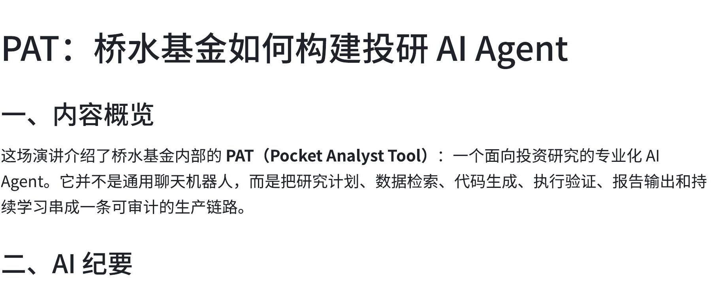
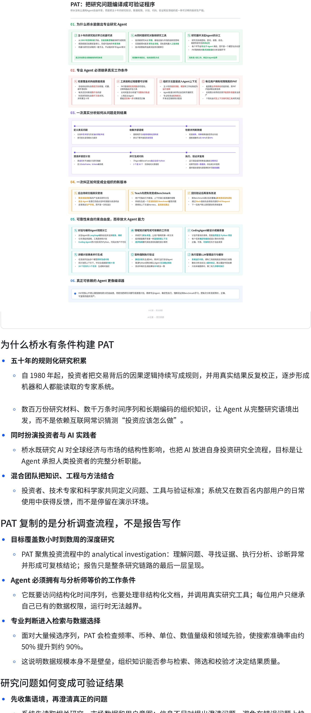

[简体中文](README.md) | [English](README_EN.md)

# DingTalk-style Minutes

手机录音、会议录音、采访音频，都能变成一份**钉钉闪记风格的飞书图文纪要**。

**一段录音 → 内容概览 + AI 图文纪要 + 分章节完整转写**

<table>
  <tr>
    <td width="33%"><a href="examples/sections/01-overview.jpg"></a><br><strong>一、内容概览</strong></td>
    <td width="33%"><a href="examples/sections/02-ai-minutes.jpg"></a><br><strong>二、AI 纪要</strong></td>
    <td width="33%"><a href="examples/sections/03-transcript.jpg"></a><br><strong>三、完整转写</strong></td>
  </tr>
</table>

## 和 AI 说一句话就行

```text
用 $dingtalk-style-minutes 把这段录音整理成飞书图文纪要。
```

## 让 Codex 安装

```text
请安装 github.com/PoetCoderJun/dingtalk-style-minutes，
再安装并登录 github.com/larksuite/cli。
转写二选一：配置 DASHSCOPE_API_KEY，或在本地安装 FunASR。
```

## 许可

[MIT](LICENSE)。本项目参考钉钉闪记的信息结构，与钉钉或阿里巴巴无关联。
