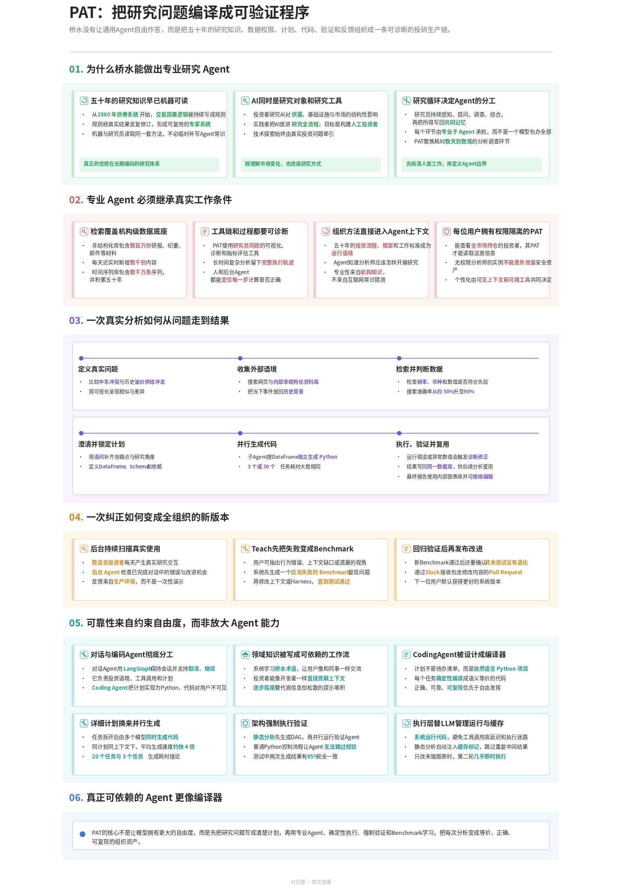
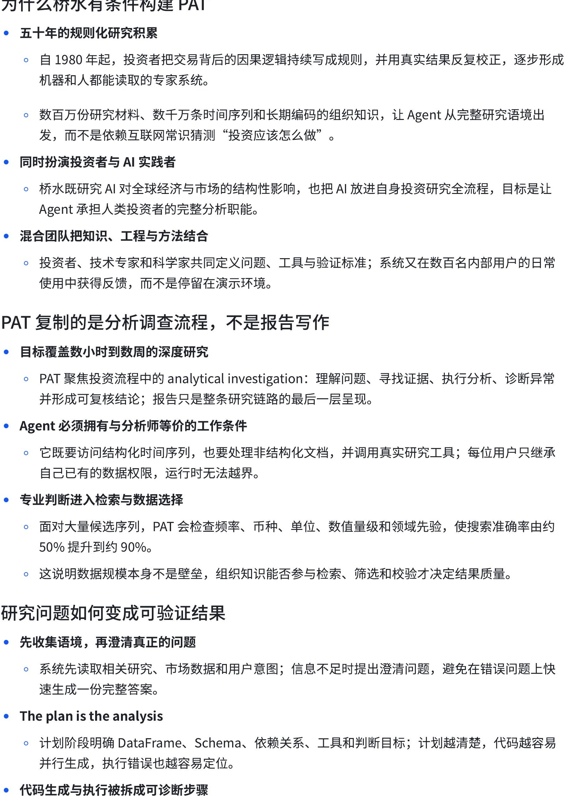
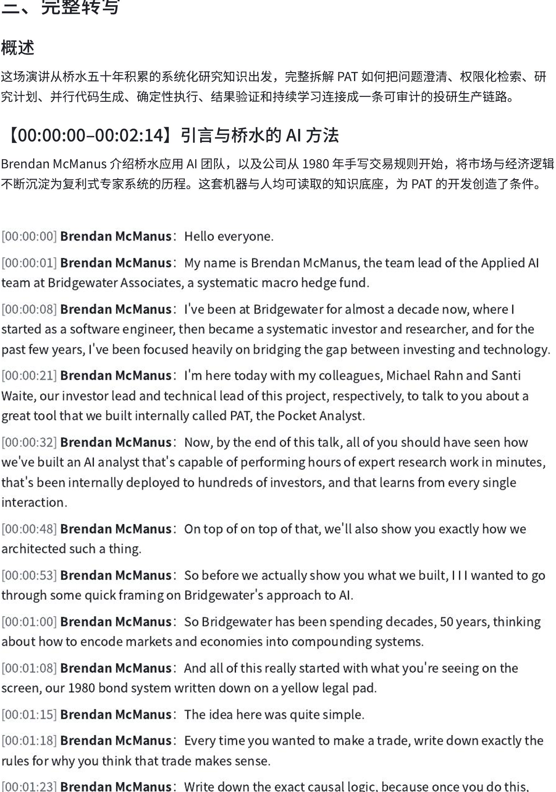

[简体中文](README.md) | [English](README_EN.md)

# DingTalk-style Minutes

Turn a phone recording, meeting, or interview into an **editable Feishu document in the style of DingTalk AI Minutes**.

**One recording → overview + graphic minutes + chaptered full transcript**

<table>
  <tr>
    <td width="33%"><a href="examples/sections/01-ai-board.jpg"></a><br><strong>AI minutes · board</strong></td>
    <td width="33%"><a href="examples/sections/02-ai-notes.jpg"></a><br><strong>AI minutes · text</strong></td>
    <td width="33%"><a href="examples/sections/03-transcript.jpg"></a><br><strong>Full transcript</strong></td>
  </tr>
</table>

## Just tell the AI

```text
Use $dingtalk-style-minutes to turn this recording into a Feishu document.
```

## Ask Codex to install it

```text
Install github.com/PoetCoderJun/dingtalk-style-minutes,
then install and authenticate github.com/larksuite/cli.
For transcription, configure DASHSCOPE_API_KEY or install FunASR locally.
```

## License

[MIT](LICENSE). Inspired by the information structure of DingTalk AI Minutes. Not affiliated with DingTalk or Alibaba.
