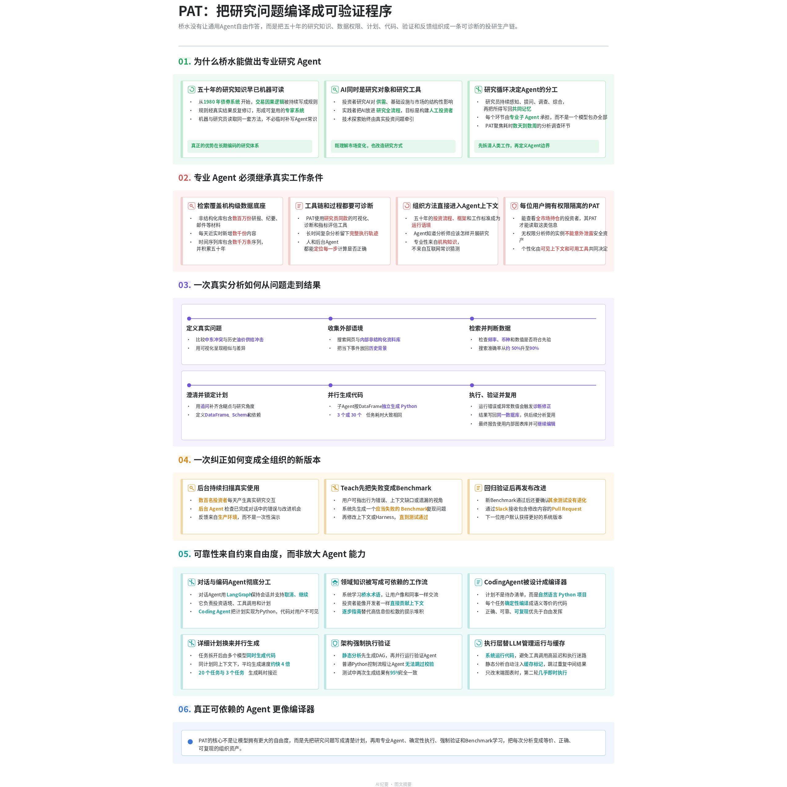

[简体中文](README.md) | [English](README_EN.md)

# DingTalk-style Minutes

Turn a phone recording, meeting, or interview into an **editable Feishu document in the style of DingTalk AI Minutes**.

**One recording → overview + graphic minutes + chaptered full transcript**



## Just tell the AI

```text
Use $dingtalk-style-minutes to turn this recording into a Feishu document.
```

## Install

```bash
npx skills add PoetCoderJun/dingtalk-style-minutes
```

Audio and video transcription requires `DASHSCOPE_API_KEY`. Feishu delivery requires an authenticated `lark-cli` session.

## License

[MIT](LICENSE). Inspired by the information structure of DingTalk AI Minutes. Not affiliated with DingTalk or Alibaba.
